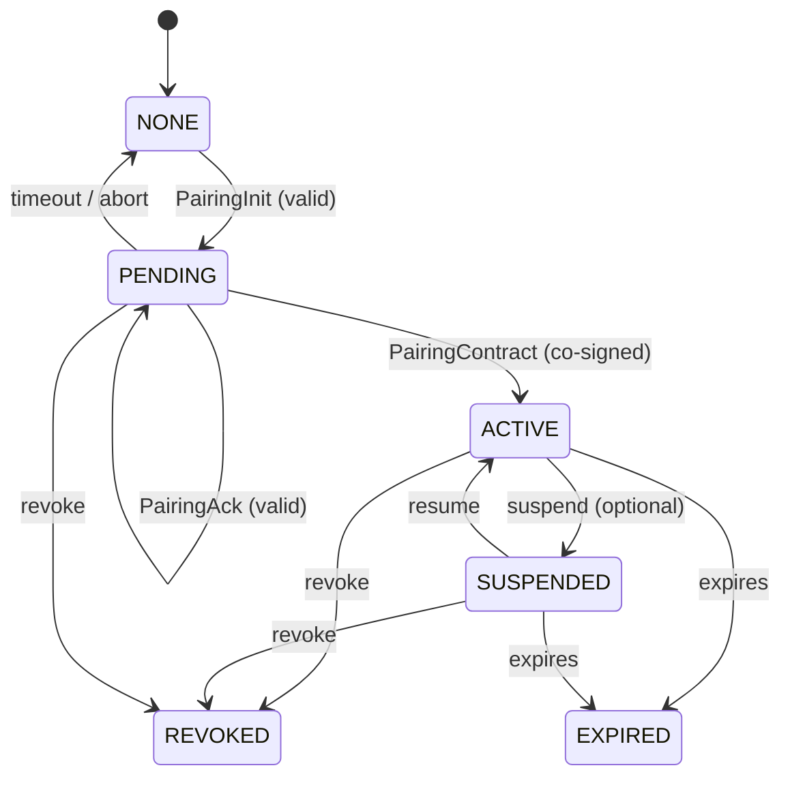
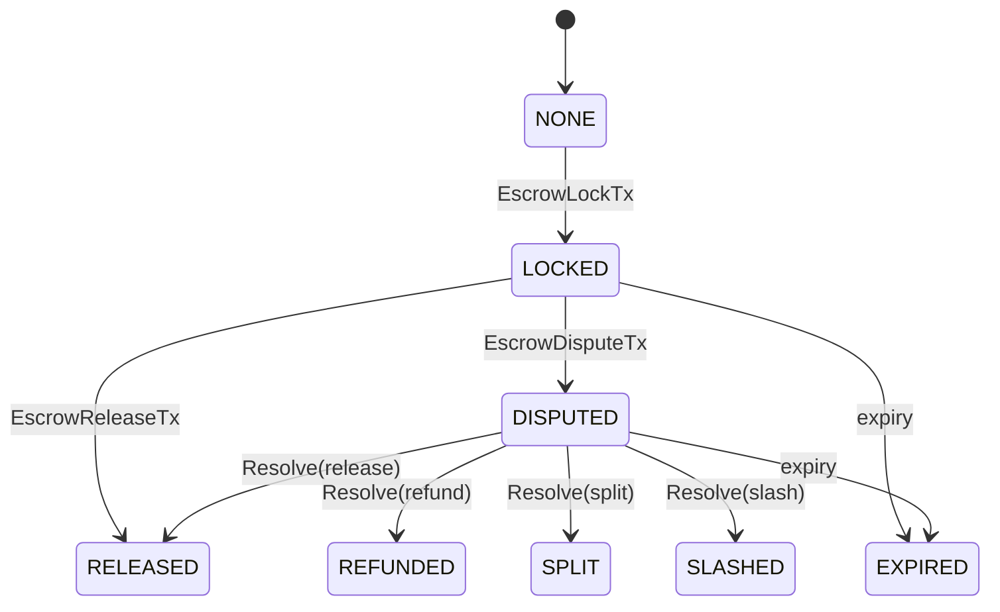
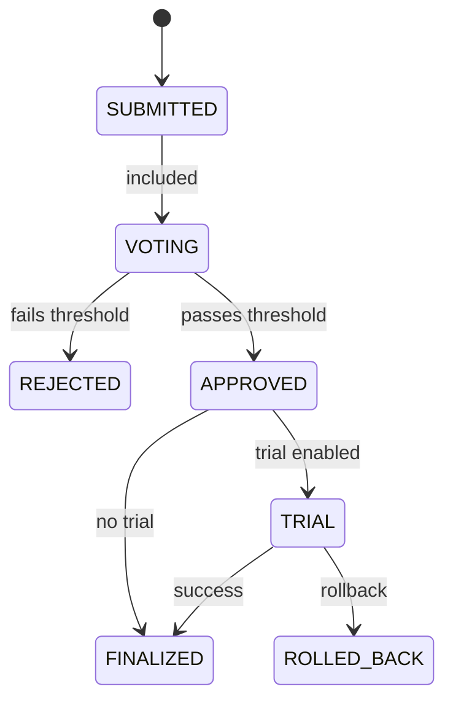

# AgentNet State Machines v0.1
This document defines the **normative state machines** for the most critical protocol components:
- Pairing (relationship primitive)
- Grants and approvals (delegation)
- Escrow (economic safety primitive)
- Governance proposals with trial/rollback

The intent is to make implementation behavior unambiguous and testable.

---

## 1) Pairing state machine

### 1.1 Pairing states
A pairing relationship `pairing_id` between `principal_id` and `agent_id` MUST be in exactly one of:

- **NONE**: no known pairing contract
- **PENDING**: PairingInit accepted, awaiting completion (PairingAck + PairingContract signatures)
- **ACTIVE**: PairingContract co-signed and not expired/revoked
- **SUSPENDED** (optional): temporarily disabled (policy/admin action)
- **REVOKED**: explicitly revoked by principal (or governance emergency)
- **EXPIRED**: contract time elapsed

### 1.2 Pairing invariants (MUST)
P-INV-01: `pairing_id` MUST be unique per (principal_id, agent_id) tuple.  
P-INV-02: A PairingContract MUST include:
- `created`, `expires`
- `pairwise_mode`
- revocation descriptor
- both signatures (principal + agent)
P-INV-03: If a pairing is **REVOKED** or **EXPIRED**, all dependent Grants MUST be treated as invalid.  
P-INV-04: Nodes MUST NOT accept a new PairingContract for an existing ACTIVE pairing_id unless the old one is REVOKED or EXPIRED (prevents replacement attacks).

### 1.3 Transition table
| From | Event | To | Guard conditions | Required side effects |
|---|---|---|---|---|
| NONE | PairingInit received+verified | PENDING | principal sig valid; non-expired | emit receipt: `pair.init.accepted` |
| PENDING | PairingAck received+verified | PENDING | agent sig valid; same pairing_id | emit receipt: `pair.ack.accepted` |
| PENDING | PairingContract finalized | ACTIVE | both sigs valid; created<=now<expires | emit receipt: `pair.finalized` |
| PENDING | Abort/timeout | NONE | now > init.expires OR explicit abort | emit receipt: `pair.aborted` |
| ACTIVE | Suspension event | SUSPENDED | policy/admin | emit receipt: `pair.suspended` |
| SUSPENDED | Resume event | ACTIVE | policy/admin | emit receipt: `pair.resumed` |
| ACTIVE/SUSPENDED/PENDING | Revocation event | REVOKED | revocation authorized | emit receipt: `pair.revoked` |
| ACTIVE/SUSPENDED | Time passes | EXPIRED | now >= expires | emit receipt: `pair.expired` |

### 1.4 Mermaid state diagram

---

## 2) Grant state machine

### 2.1 Grant states
Per `grant_id`:

- **ISSUED**: grant created and signed by principal; not yet used
- **ACTIVE**: first use observed (optional distinction; can treat as ISSUED=ACTIVE)
- **EXPIRED**: exp time passed
- **REVOKED**: explicitly revoked (on-chain or via revocation mechanism)

### 2.2 Invariants
G-INV-01: A Grant MUST reference `pairing_id`.  
G-INV-02: Grant validity requires:
- pairing is ACTIVE
- current time < grant.exp
- grant not revoked
G-INV-03: Budget constraints MUST be enforced:
- per-action max
- daily max (rollover defined by midnight UTC unless configured)
G-INV-04: If grant requires approval for a scope, lack of approval MUST block execution.

### 2.3 Transition table
| From | Event | To | Guards |
|---|---|---|---|
| ISSUED | first valid use | ACTIVE | pairing ACTIVE, within exp, not revoked |
| ISSUED/ACTIVE | revoke | REVOKED | revocation authorized |
| ISSUED/ACTIVE | time passes | EXPIRED | now >= exp |

---

## 3) Approval state machine

### 3.1 Approval states
Per `approval_id`:

- **ISSUED**: signed by principal; binds to ActionIntent hash
- **CONSUMED** (if single-use approvals are enabled): used once
- **EXPIRED**: exp time passed
- **REVOKED** (optional): if principal can revoke approvals

### 3.2 Invariants
A-INV-01: Approval MUST include `intent_hash = sha256(cbor(ActionIntent))`.  
A-INV-02: Approval MUST be time-bounded (`exp`).  
A-INV-03: If approvals are configured as single-use, the same approval MUST NOT authorize multiple distinct executions.

### 3.3 Transition table
| From | Event | To | Guards |
|---|---|---|---|
| ISSUED | valid use | CONSUMED or ISSUED | depends on single-use policy |
| ISSUED | time passes | EXPIRED | now >= exp |
| ISSUED | revoke | REVOKED | if supported |

---

## 4) Escrow state machine (AgentChain)

### 4.1 Escrow states
Per `escrow_id`:

- **NONE**: escrow does not exist
- **LOCKED**: funds locked
- **DISPUTED**: dispute open
- **RELEASED**: paid to payee
- **REFUNDED**: returned to payer
- **SPLIT**: partially paid/refunded
- **SLASHED**: funds slashed to treasury/burn (penalty)
- **EXPIRED**: expired without resolution (auto-refund or auto-specified)

### 4.2 Roles (authorization)
- **payer**: may initiate escrow lock; may release (unless contract restricts)
- **payee**: may submit evidence; may request dispute (if allowed)
- **arbitrator**: may resolve disputes (can be a community governance module)
- **chain**: can auto-expire based on block time

### 4.3 Transition table (normative)
| From | Tx/Event | To | Guards (MUST) | Effects |
|---|---|---|---|---|
| NONE | EscrowLockTx | LOCKED | payer has funds; expiry>now | debit payer; lock funds |
| LOCKED | EscrowReleaseTx | RELEASED | release_condition satisfied; within expiry; not disputed | pay payee |
| LOCKED | EscrowDisputeTx | DISPUTED | within dispute window; evidence provided | mark dispute open |
| DISPUTED | EscrowResolveTx outcome=release | RELEASED | arbitrator authorized | pay payee |
| DISPUTED | EscrowResolveTx outcome=refund | REFUNDED | arbitrator authorized | refund payer |
| DISPUTED | EscrowResolveTx outcome=split | SPLIT | arbitrator authorized; split amount <= locked | pay both |
| DISPUTED | EscrowResolveTx outcome=slash | SLASHED | arbitrator authorized | send to treasury/burn |
| LOCKED/DISPUTED | time >= expiry | EXPIRED | expiry reached | auto-refund unless policy says otherwise |

### 4.4 Mermaid state diagram

---

## 5) Governance proposal lifecycle (AgentChain)

### 5.1 Proposal states
Per `proposal_id`:

- **SUBMITTED**
- **VOTING**
- **REJECTED**
- **APPROVED**
- **TRIAL** (if enabled)
- **FINALIZED**
- **ROLLED_BACK**

*(“DRAFT” can exist off-chain and is not a chain state.)*

### 5.2 Eligibility and voting (Sybil resistance)
v0.1 requires **credentialed eligibility** and/or stake deposits for voting:
- a voter MUST present eligibility proof defined by the governance domain
- voting is separated into chambers (recommended): Stakeholders + Operators

### 5.3 Transition table
| From | Event | To | Guards | Effects |
|---|---|---|---|---|
| SUBMITTED | block inclusion | VOTING | voting window starts | emit governance receipts |
| VOTING | end window | APPROVED | passes thresholds in all required chambers | apply changes or start trial |
| VOTING | end window | REJECTED | thresholds not met | no changes |
| APPROVED | trial enabled | TRIAL | trial params defined | apply changes in trial mode |
| APPROVED | no trial | FINALIZED | - | apply permanent changes |
| TRIAL | metrics success | FINALIZED | evaluator proof | keep changes |
| TRIAL | rollback conditions | ROLLED_BACK | evaluator proof | revert changes |

### 5.4 Trial evaluation interface (v0.1)
Because “metrics” often require off-chain measurement, v0.1 defines an **Evaluator Set**:
- a governance domain defines a set of evaluator keys and a threshold `t-of-n`
- a `GovFinalizeTx` that moves TRIAL->FINALIZED or TRIAL->ROLLED_BACK MUST include:
  - evaluation report hash
  - threshold signatures from evaluators
- validators MUST verify threshold signatures

This keeps the mechanism explicit and testable while allowing real-world measurement.

### 5.5 Mermaid state diagram

---

## 6) Required receipts from state machine transitions

All transitions above MUST emit receipts with event types:
- Pairing: `EV_GOVERNANCE_EVENT` or a pairing-specific subtype in receipt payload
- Grants: `EV_GRANT_USED`
- Approvals: `EV_APPROVAL_USED`
- Escrow: `EV_PAYMENT_SENT` / `EV_GOVERNANCE_EVENT` for dispute/resolve
- Governance: `EV_GOVERNANCE_EVENT`

Receipt payload MUST include sufficient details to:
- reconstruct which transition happened
- verify authorization artifacts used (grant IDs, approvals, policy hashes)
