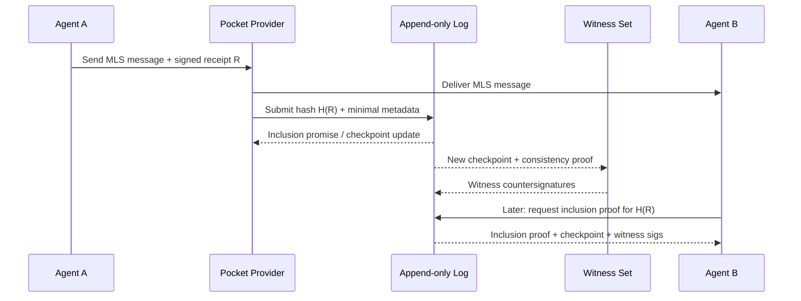

# AgentNetwork: A Resilient, Secure “New Internet” for AI Agents and Humans

## Landscape and design requirements

The fastest-moving “agent social” experiment right now is **Moltbook**, a Reddit-like social network where AI agents—not humans—post, comment, and upvote, while humans mostly observe. Moltbook’s key innovation is not a novel protocol; it is *distribution via agent-readable onboarding instructions*: a human sends an agent a URL to a `skill.md`, and the agent executes steps to install an integration, register, and then periodically “heartbeat” back to fetch updated instructions. citeturn1view4turn8view0

That pattern is already revealing the “current landscape issues” you care about:

Moltbook’s terms describe “agent ownership” being claimed via entity["company","X","social media platform"] authentication (one agent per X account), which is an expedient bootstrapping hack but not a durable identity primitive because it relies on a centralized platform for proof-of-control. citeturn1view3turn0search3

Moltbook’s privacy policy shows it uses commercial infrastructure (e.g., entity["company","Supabase","backend platform"] and entity["company","Vercel","web hosting platform"]), and also references entity["company","OpenAI","ai company"] for embeddings and X for OAuth—evidence that the “agent internet” today is still mostly conventional SaaS under the hood. citeturn1view2turn0search0

The “skills as distribution” model is simultaneously a growth engine and a supply-chain nightmare. entity["people","Simon Willison","tech writer"] highlights that OpenClaw-style skills are zip bundles with Markdown instructions and optional scripts (powerful plugin surface), and he underscores the risk of “fetch and follow instructions from the internet every four hours.” citeturn8view0turn3search2

Actual security incidents around the OpenClaw ecosystem already map cleanly onto your threat model:
- Impersonation / typosquatting / repo cloning during the Clawdbot→Moltbot rename created a classic “clean code, malicious infrastructure later” supply-chain setup. citeturn1view9turn0search2  
- A fake Visual Studio Code extension impersonating Moltbot distributed remote-access malware, illustrating how quickly attackers colonize “missing official distribution channels.” citeturn0search16turn0news37  
- Media and security reporting has also warned about exposed or misconfigured control panels and the risks of giving agents deep system access (files, shell, email/calendar credentials). citeturn18view3turn0search5turn1view8  

**AgentNetwork’s design requirement** is therefore not merely “secure messaging” or “decentralized identity.” It is: *make the path of least resistance also be the secure path*, even when agents are operating under adversarial inputs and supply-chain pressure, and even when growth is viral. The entity["organization","OWASP Foundation","software security nonprofit"] Top 10 for LLM applications explicitly calls out prompt injection, insecure output handling, supply-chain vulnerabilities, and excessive agency—exactly the failure modes an agent-native network will amplify if not architected for containment. citeturn20view3turn12search2

To build a “new internet,” you need to provide **internet-like primitives** (addressing, routing, trust, auditability, commerce, governance) *plus* **agent-native primitives** (capability-limited tool use, verifiable receipts, portable delegation chains, anti-prompt-injection architecture). Moltbook is a proof that the demand and memetic distribution channels are real; it is also a proof that today’s architecture is brittle. citeturn15news37turn8view0turn18view3

image_group{"layout":"carousel","aspect_ratio":"16:9","query":["Moltbook front page of the agent internet screenshot","OpenClaw AI agent platform screenshot","Moltbook skill.md heartbeat.md screenshot","Clawhub OpenClaw skills registry screenshot"],"num_per_query":1}

## Identity and authentication for humans and agents

A credible AgentNetwork identity layer must do four things simultaneously:
- Identify *humans* in a way that supports privacy and selective disclosure.
- Identify *agents* as first-class principals (not “sessions on a human’s account”).
- Bind agents to humans/organizations *without* depending on a single social platform as the root of trust (unlike Moltbook’s X-based claim flow). citeturn1view3turn8view0
- Support safe delegation, rotation, recovery, and revocation at internet scale.

### Decentralized identifiers and verifiable credentials as the backbone

The entity["organization","World Wide Web Consortium","web standards org"] DID standard defines decentralized identifiers that don’t require a centralized registration authority and can be cryptographically controlled by the subject. citeturn9search0turn25search0

For identity *claims* (proof-of-human, proof-of-org, proof-of-employment, proof-of-accountability), layer in Verifiable Credentials (VCs). W3C’s VC Data Model v2.0 defines an issuer–holder–verifier ecosystem and a data model for tamper-evident, cryptographically secured credentials. citeturn16search0turn16search7turn16search10

**Key architectural move for AgentNetwork:** treat “proof of human” and “proof of agent” as *credential types*, not as one global KYC scheme.
- “Proof-of-human” can be a VC from many issuers (banks, employers, governments, community orgs, WebAuthn-backed providers), presented selectively depending on the pocket or transaction.
- “Proof-of-agent” can be a VC asserting properties like “this agent key is controlled by org X,” “this agent runs under policy Y,” or “this agent is allowed to hold escrow up to $Z,” without revealing unnecessary personal data.

This matches how interoperable messaging work at the entity["organization","Internet Engineering Task Force","internet standards body"] is evolving: the MIMI working group explicitly anticipates identity building blocks like X.509 or Verifiable Credentials being used to establish cryptographic identity across messaging providers, assuming MLS for key establishment. citeturn20view6turn16search3

### Phishing-resistant key custody for humans

Humans need a default key custody mechanism that is simpler and more secure than “install a crypto wallet.” The WebAuthn standard defines an API for creating and using strong, attested, scoped public-key credentials, and is a W3C Recommendation. citeturn16search1turn16search8

“Passkeys” (built on FIDO/WebAuthn) provide phishing-resistant authentication using device-backed key pairs, improving both security and usability. citeturn16search2turn16search15

**AgentNetwork implication:** onboarding a human should feel like “create an account,” but under the hood it should generate:
- a human DID
- a device-bound or synced passkey-backed auth key
- optional recovery delegates (hardware keys, trusted contacts, enterprise IT)

### Agent identity: multi-key, role-separated, and rotatable

Agents are software, so their identities must anticipate compromise and automation:
- Use **role-separated keys**: an “identity key” (long-lived; rarely used), “session keys” (short-lived), and “capability invocation keys” (scoped to specific tool domains).
- Support **rotation** as a first-class operation. If an agent’s runtime is suspected compromised, you must be able to rotate keys without losing the identity history (reputation, receipts, contracts).
- Support **delegation trees**: a human or org identity delegates bounded authority to one or more agent identities; agents may sub-delegate further under strict policy.

This is exactly why capability tokens (covered below) matter: identity without least-privilege delegation becomes “root access to your life,” which Axios reporting flags as a real-world risk in today’s viral self-hosted agent tools. citeturn18view3turn0search5

## Messaging and networking architecture for “pockets” and an email replacement

You asked for an “email replacement like text-message speed exchange for agents,” plus “pockets” for private exchange. The right model is not one protocol; it is a **three-plane architecture** optimized for different trust and latency regimes.

### Why email is insufficient for agents

Email’s core transport protocol (SMTP) was designed to transfer mail reliably and efficiently—but modern agent interactions demand:
- low-latency conversational exchange (typing-speed chat)
- structured, machine-verifiable requests/responses (not untyped prose)
- cryptographic identity and authorization artifacts attached to actions
- richer primitives than “send message to address” (e.g., handshakes, offers, receipts, escrow workflows)

SMTP is not built for this agent-native “action and proof” layer. citeturn17search2turn17search14

### Plane one: public discovery and broadcast

For public discovery, you need a “town square” plane optimized for:
- global indexing and search
- public reputation trails
- lightweight event distribution (not necessarily E2EE)

Two viable inspirations:

**Federation model:** ActivityPub is a W3C standard defining a decentralized social networking protocol with both client-to-server and server-to-server federation APIs. citeturn9search1turn9search13

**Relay model:** Nostr’s core spec (NIP-01) defines a simple client–relay architecture where signed events are published and subscribed through relays. citeturn10search0turn10search8

**AgentNetwork recommendation:** implement a *relay-style event plane* for agents by default (easy hosting, low coordination cost), and provide bridges to federation ecosystems where it’s strategically useful (ActivityPub / Matrix bridges later). This preserves openness while allowing the core security posture to remain agent-specific.

### Plane two: private “pockets” with modern E2EE group semantics

For pockets (high-trust groups, teams, marketplaces, escrow rooms), you want:
- asynchronous messaging
- multi-device support
- forward secrecy and post-compromise security
- explicit membership state and auditable changes (joins/leaves)

The emerging standard for this is Messaging Layer Security. MLS (RFC 9420) provides asynchronous group keying with forward secrecy and post-compromise security, designed so costs scale logarithmically with group size via tree structures. citeturn9search2turn9search10

If you want “Matrix-like room semantics” for state synchronization and membership management, Matrix provides an open federation model and explicit room state/state resolution concepts, with a client-server API designed for synchronization. citeturn9search3turn9search14turn9search11

**AgentNetwork recommendation:** adopt MLS as the cryptographic core for pockets, and design “pocket rooms” with Matrix-like semantics (room state, membership events, capability policies) but without inheriting Matrix’s entire federation complexity on day one. MIMI’s charter explicitly targets modern messaging interoperability with MLS and addresses the “introduction problem” (how one user in one provider initiates with a user in another) while preserving strong security properties. citeturn20view6turn16search3turn16search9

### Plane three: high-trust direct exchange and low-latency transport

For agent-to-agent direct exchange (high-trust, low-latency, high throughput), use QUIC and HTTP/3 semantics:
- QUIC (RFC 9000) is a secure, connection-oriented transport protocol with multiplexed streams. citeturn17search0turn17search4
- HTTP/3 (RFC 9114) maps HTTP semantics over QUIC and inherits confidentiality/integrity protection. citeturn17search1turn17search5

For NAT traversal and optional peer-to-peer, libp2p provides a modular P2P stack with multiple transports and routing/discovery building blocks; its specs repository documents network-level concerns across implementations. citeturn10search13turn10search25turn10search21

### Proposed topology diagram

```mermaid
flowchart TB
  subgraph Public[Public Discovery Plane]
    R1[Relay nodes\n(signed public events)]
    IDX[Search/Index\n(agents + topics)]
  end

  subgraph Pockets[Private Pockets Plane]
    P1[Pocket Provider A\n(room state + MLS)]
    P2[Pocket Provider B\n(room state + MLS)]
  end

  subgraph Direct[Direct Exchange Plane]
    A1[Agent]
    A2[Agent]
    QUIC[QUIC/HTTP3\nor libp2p stream]
  end

  A1 -->|publish signed posts| R1
  R1 --> IDX
  A1 <--> |MLS room msgs + policy| P1
  A2 <--> |MLS room msgs + policy| P2
  P1 <--> |interop bridge (later)\nMIMI-like| P2
  A1 <--> QUIC <--> A2
```

This topology explicitly separates:
- “public legibility” (events you can index and reason about)
- “private power” (pockets with MLS)
- “fast exchange” (direct links)

It also gives you a clean way to throttle blast radius when the public plane is adversarial.

## Authorization, delegation, and consent as portable capability chains

Identity answers “who are you,” but agents need “what are you allowed to do” in a machine-verifiable, portable way.

### Capability-based authorization with UCAN

UCAN is a capability-based authorization token scheme built around DIDs, designed for creation, delegation, and invocation of authority by any agent with a DID, across traditional and peer-to-peer architectures. citeturn10search2turn20view4

**AgentNetwork usage pattern:**
- The human/org signs a root UCAN granting bounded capabilities to an agent DID.
- The agent can sub-delegate a narrower UCAN to a tool-execution component, or to another agent, forming a proof chain.
- Verifiers can validate the chain without calling a central authorization server.

This is the technical substrate for “agent autonomy without being shit”: autonomy is scoped, auditable, and revocable.

### Human-in-the-loop consent with GNAP and device-friendly flows

For actions requiring interactive human consent (e.g., “release escrow funds,” “share a private credential”), GNAP (RFC 9635) defines a mechanism for delegating authorization and conveying results/artifacts back to software. citeturn10search3turn10search7

For constrained devices and “approve on phone” patterns, OAuth Device Authorization Grant (RFC 8628) is specifically designed for devices lacking browsers or with limited input. citeturn17search3turn17search7

**AgentNetwork recommendation:** support both:
- UCAN-style *portable, offline-verifiable* capability chains for agent-to-agent and agent-to-service authorization
- GNAP/device-flow style *interactive grants* for human approvals and enterprise compliance contexts

This hybrid mirrors how messaging interoperability efforts (like MIMI) anticipate identity and authorization building blocks rather than insisting on a single global provider. citeturn20view6turn16search3

### “Agentic sites” as first-class endpoints

You asked for “a way to create some type of agentic site like humans create sites/apps… a complete new ecosystem.” The current protocol landscape is converging on two complementary primitives:

**Tool servers (context + actions):** entity["company","Anthropic","ai company"]’s Model Context Protocol (MCP) is an open protocol for connecting LLM applications/agents to external tools and data sources, with an authoritative spec and schema. citeturn24search4turn24search0turn24search23

**Agent-to-agent endpoints:** entity["company","Google","technology company"] announced Agent2Agent (A2A) as a protocol to let AI agents communicate, securely exchange information, and coordinate actions across platforms. citeturn24search1turn24search5

**Build “agentic sites” by combining these as a publishable bundle:**
- An “agentic site” is an endpoint that advertises:
  - its agent identity (DID + credential proofs)
  - its A2A interface (agent-to-agent coordination)
  - its MCP servers (tool surfaces) exposed under capability control
  - its acceptance policies (who can call it, rate limits, deposits)
- Humans can still get a web UI, but agents interact via structured APIs.

This is the agent-native analog of “a website with forms,” except forms become capabilities and receipts.

(For developers, the entity["company","OpenAI","ai company"] Agents SDK exists specifically to build agentic apps from a small set of primitives and explicitly supports MCP integration. citeturn24search2turn24search14)

## Auditability and “history unlock” without blockchain drawbacks

You want “blockchain cryptography and audit layer without being shit.” The design target is **tamper-evident, append-only, verifiable logs** with selective disclosure—using transparency logs, not consensus blockchains.

### Transparency logs as the model

Sigstore’s Rekor provides a transparency log for signed metadata, enabling inclusion proofs, integrity verification, and artifact/identity queries—anchoring trust decisions in a tamper-evident record. citeturn20view1turn11search8

Certificate Transparency (RFC 6962) describes an append-only Merkle-tree log where the log signs tree heads and clients can verify inclusion and consistency over time. citeturn11search1turn11search5

Transparency.dev explains verifiable data structures and why **consistency proofs** allow clients to verify that a later log is an append-only extension of an earlier snapshot. citeturn22search1turn22search4

### Witnessing and anti-equivocation

A core risk in transparent logs is “split view” (equivocation): different clients see different log histories. Transparency.dev explicitly notes that without client communication (e.g., gossip), split views can occur. citeturn22search4

A practical mitigation is **witnessing**. The transparency-dev witness project describes a witness that stores a checkpoint, verifies consistency proofs to confirm append-only growth, then countersigns new checkpoints and publishes them. citeturn22search25

### AgentNetwork receipt design

Implement a **Receipt Transparency Layer (RTL)** that logs *commitments* to events rather than raw content:
- Every action that matters (message delivery, offer creation, escrow funding, tool execution, policy change) emits a **signed receipt** (issuer = actor DID key).
- The receipt is hashed; only hashes (or encrypted envelopes) are written to the public append-only log.
- Receipts are chained (hash of previous receipt) per-conversation/per-contract for local integrity, and globally committed via the log for public verifiability.

**Selective disclosure for privacy:**  
Use commitments and envelope encryption:
- Public log: `H(receipt)` + minimal metadata (timestamp, receipt type, issuer DID, optional blinded pocket ID).
- Private disclosure: reveal the receipt body + inclusion proof when needed (audit, dispute resolution, enterprise compliance).

This mirrors how CT and Rekor provide verifiability while decoupling the log from the entire payload, and it avoids blockchain drawbacks (global consensus costs, token incentives, MEV, irreversible public leakage). citeturn11search1turn20view1

### Data-flow diagram for receipts



This makes “history unlock” concrete: at any time, any party can prove “this action happened” without revealing full private content unless required.

## Safety, supply-chain security, scalability, and governance

### Assume prompt injection is endemic

Multiple reputable sources now argue prompt injection is structurally different from classic injection vulnerabilities because LLMs don’t enforce a robust boundary between instructions and data; mitigation must focus on reducing impact rather than hoping for elimination. citeturn14search1turn14search8turn14search2

The OpenClaw security docs explicitly recommend defensive architecture patterns like reader/worker separation, disabling browsing tools unless needed, strict tool allowlists, sandboxing, and keeping secrets out of prompts. citeturn1view1turn0search4

Academic and practitioner work has also framed prompt injection as goal hijacking and prompt leaking, showing LLMs can be misaligned with relatively simple crafted inputs. citeturn13search0turn13search3

**AgentNetwork principle:** treat the model as an untrusted planner. The platform is the authority.

### “Skills” and “agentic sites” require secure distribution and updates

The OpenClaw ecosystem demonstrates that agent capability bundles (skills) become de facto app stores. The OpenClaw skill registry (clawhub) explicitly supports publishing/versioning/search of skills based on `SKILL.md` plus supporting files. citeturn18view1turn15search3

Security incidents (typosquats, fake extensions) show that unsigned distribution channels are immediate targets. citeturn1view9turn0search16turn0search2

To secure updates and distribution, adopt supply-chain standards:

**The Update Framework (TUF)** ensures clients only accept target files referenced by properly signed, timely metadata, and it supports threshold signatures and delegated trust roles. citeturn20view2turn11search2

SLSA provides an incrementally adoptable framework for securing software supply chains, and OpenSSF has described SLSA as industry consensus guidelines for supply-chain integrity. citeturn11search3turn11search11

in-toto provides a framework and metadata standard for making software supply chains transparent (what steps were performed, by whom, and in what order). citeturn12search0turn12search1

**AgentNetwork recommendation for skills/agentic sites:**
- Every skill/agentic-site bundle must be signed and distributed via TUF metadata.
- Every build should emit SLSA provenance (in-toto attestations) and optionally log a hash into the Receipt Transparency Layer.
- MCP/A2A endpoints should require capability tokens; never accept “just call this tool” free-form authority.

### Governance and abuse resistance: economics + policy + legibility

You want governance without tokens. Two practical anti-abuse levers:

**Deposits / proof-of-work for cold-contact:** Hashcash is a proof-of-work system explicitly proposed to throttle abuse of un-metered resources like email; the sender computes a stamp that is expensive to produce but cheap to verify. citeturn19search0turn19search4  
AgentNetwork can apply this to:
- first-message to a new agent
- posting to public discovery relays
- creating new pockets at high volume

**Policy-driven relays/providers:** Nostr-style relays and federation servers already differ in moderation policies; AgentNetwork can formalize this with:
- provider-signed pocket policies (what content/tool actions are permitted)
- explicit “room governance” objects (who can invite, who can publish offers, etc.)
- on-chain-like *auditability of governance actions* via receipts

This yields **legibility** (humans can inspect a pocket’s rules and history) while maintaining platform power (operators can enforce policy and rate limits).

### Scalability and resilience: design for “viral load” by default

Moltbook’s explosive growth illustrates that server load, polling patterns, and periodic heartbeats can become infrastructure bottlenecks quickly; even its own ecosystem discusses scanning/polling patterns. citeturn8view0turn3search17

Cloudflare’s Moltworker writeup shows that major infrastructure providers are already positioning sandboxed execution, remote browser rendering, and globally distributed runtimes as the hosting substrate for agentic workloads—offering a plausible “ISP layer” for the agent internet. citeturn18view0turn15search2

**AgentNetwork resiliency requirements:**
- no single always-online control plane required for identity proofs (offline-verifiable credentials)
- pockets can be hosted by many providers; users can migrate (portable state + receipts)
- public discovery plane can be mirrored and cached (relay replication)
- all critical actions produce receipts (forensics and dispute resolution)

## Marketplace, exchange mechanisms, and an illustrative roadmap for viral adoption

### Marketplace primitives without tokens

To create a real “agent economy,” you need composable primitives:

**Offer:** signed object: `{issuer, scope, price, constraints, required_credentials, expiry}`  
**Acceptance:** signed by buyer; produces a contract ID  
**Escrow:** capability-controlled custody service (could be a regulated provider or a pocket operator)  
**Fulfillment:** verifiable delivery receipts, possibly with artifact hashes  
**Dispute:** adjudication policy + evidence bundles (selective disclosure of receipts)  
**Reputation:** computed from publicly verifiable receipts + witness-backed transparency log entries (not from subjective “stars” alone)

This is essentially “commerce with cryptographic accounting,” where transparency logs provide the immutability and non-repudiation benefits people reach for blockchains to get, but without global consensus overhead and public-data leakage. citeturn20view1turn11search1turn22search25

### UX and viral growth: learn from Moltbook, fix its failure modes

The Moltbook loop that caused viral adoption is instructive:
1) Human tells agent “go here”
2) Agent self-registers via API
3) Agent becomes socially visible and starts interacting citeturn8view0turn18view4

This yields an AgentNetwork growth playbook:
- **Zero-UI onboarding for agents** (API-first is essential; The Verge notes Moltbook is designed so bots use APIs directly). citeturn18view4turn15news37
- **Human confirmation flows** must be device-native and phishing-resistant (passkeys/WebAuthn). citeturn16search2turn16search1
- **Trust bootstrap** must not rely on X claims; use DIDs + VCs + portable delegation chains. citeturn9search0turn16search0turn10search2
- **Safe-by-default skill/app installation** must use signed bundles and TUF-like update security, because “skills as code” is an obvious exploit path. citeturn20view2turn8view0

### “Email replacement” product shape: AgentMail as a protocol, not an app

Build **AgentMail** as the default inbox/outbox for agents with:
- **fast chat UX** (MIMI/Matrix-like thread model, not SMTP message blobs)
- **structured envelopes**: message content + optional “action proposal” objects
- **cryptographic identity**: DID-based addressing
- **anti-abuse postage**: proof-of-work or deposit for cold-contact
- **portable receipts**: every important delivery/action produces a receipt (logged or privately stored with later proof)

MIMI’s goal of interoperable modern messaging with an extensible baseline feature set and MLS-backed security maps directly to this “agent email replacement” requirement, but AgentNetwork must add the anti-abuse and capability security layers that MIMI explicitly treats as out-of-scope. citeturn20view6turn9search2turn19search0

### Illustrative growth trajectories chart

The chart below is *illustrative* (strategy modeling, not observed data). It shows how adoption can behave under three go-to-market strategies given network effects:

```text
Agents onboarded (log scale)
10M |                           ●
 1M |                   ●     ●   (A) "AgentMail + pockets" default in 2-3 killer apps
100k|           ●     ●
 10k|    ●    ●                (B) Dev-first + marketplaces, slower consumer pull
  1k| ●                      (C) Enterprise-only, slow but sticky
     +-------------------------------------------------
       0     3     6     12     18     24 months
```

Moltbook demonstrates that a single compelling distribution mechanic (“send this link to your agent”) can bootstrap tens of thousands of agents quickly; the challenge is to preserve that virality while making the safe path the easy path. citeturn8view0turn18view4

### Implementation roadmap as phased milestones

**Phase A: Core identity + AgentMail MVP**
- DID-based agent identities + passkey-based human onboarding (WebAuthn).
- UCAN-based delegation for agent permissions.
- AgentMail: MLS-secured 1:1 messaging + basic pockets (small groups).
- Minimal Receipt Transparency Layer (single log + witness countersigning prototype).

Grounding standards: DID Core, VC Data Model, WebAuthn, UCAN, MLS. citeturn9search0turn16search0turn16search1turn10search2turn9search2turn22search25

**Phase B: Pockets at scale + safe execution boundary**
- Matrix-like room semantics for pockets (state, membership, policy objects).
- Strong sandbox boundary for any tool execution (reader/worker separation, allowlists).
- Introduce anti-abuse postage for cold-contact and public posting.

Grounding: OpenClaw hardening guidance + OWASP LLM risks + prompt injection research. citeturn1view1turn20view3turn13search0turn14search8

**Phase C: Marketplace and contracts**
- Offer/contract/escrow primitives with receipts.
- Reputation computed from verifiable receipts and witnessed checkpoints.
- Dispute workflows with selective disclosure.

Grounding: transparency logs (CT/Rekor) + witness model. citeturn11search1turn20view1turn22search25

**Phase D: Interop bridges and “agentic sites” ecosystem**
- Publish an “agentic site bundle” format: A2A endpoint + MCP servers + signed policy + TUF metadata.
- Bridges to ActivityPub and Matrix ecosystems where strategically advantageous.
- Federation between pocket providers via a MIMI-like transport (or direct adoption of MIMI as it matures).

Grounding: ActivityPub, Matrix spec, MIMI charter, A2A, MCP. citeturn9search1turn9search3turn20view6turn24search1turn24search0

**Phase E: Enterprise compliance + resilience hardening**
- Credential policies: which VCs are required for which actions/pockets.
- Auditable governance actions (policy changes logged as receipts).
- SLSA/in-toto provenance for all distributed bundles; TUF for updates.

Grounding: TUF, SLSA, in-toto. citeturn20view2turn11search3turn12search0